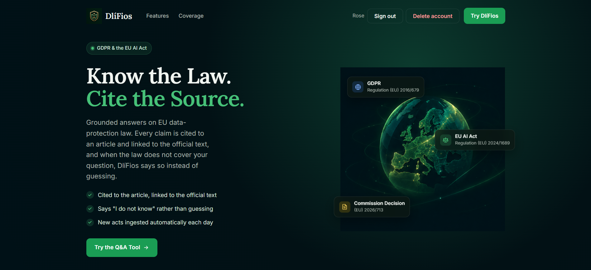
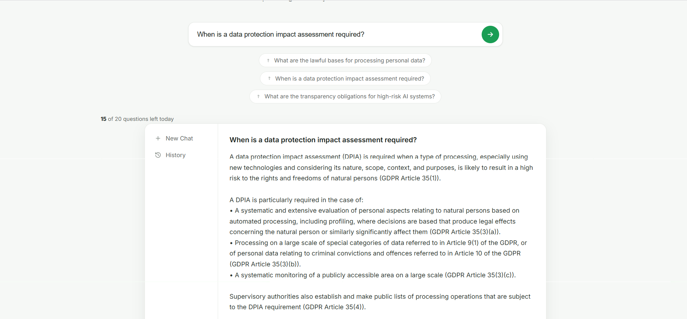
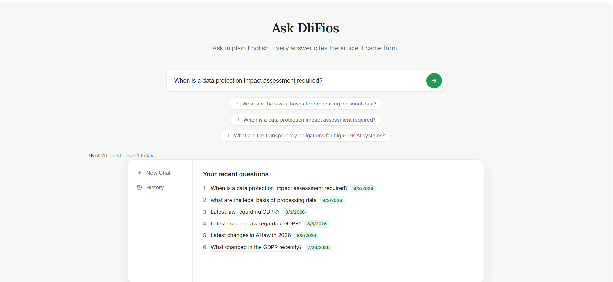
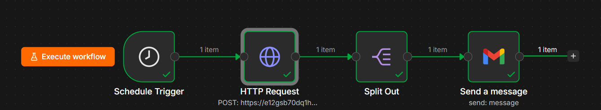
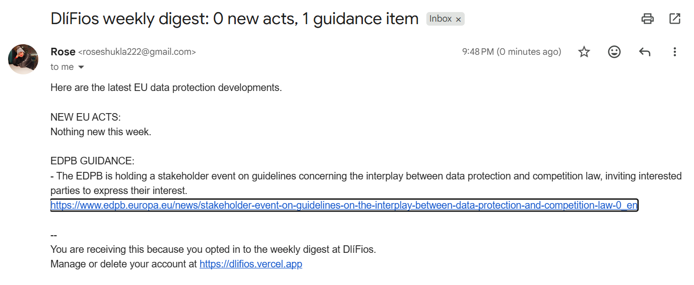

<div align="center">

# DlíFios

### Know the Law. Cite the Source.

**A question-answering system for EU data-protection law that cannot answer from memory.**

Every claim is traced to an article of the actual legislation and linked to the official text.
When the law does not cover your question, it says so instead of guessing.

**[Open the live app](https://dlifios.vercel.app)**

`TypeScript` &nbsp;`Hono` &nbsp;`Qdrant` &nbsp;`Gemini` &nbsp;`Supabase` &nbsp;`Docker` &nbsp;`n8n`

</div>



---

## The problem

General-purpose chatbots answer legal questions confidently, and sometimes invent the article number. For someone deciding whether a processing activity is lawful, a fabricated citation is worse than no answer at all: it is wrong in a way that looks authoritative.

DlíFios is built so that cannot happen. Answers are assembled only from passages retrieved out of the primary legal text, and the model is instructed to refuse when those passages do not contain the answer.



Every claim carries the act and article it came from, down to the sub-paragraph. `GDPR Article 35(3)(b)` is a specific provision a reader can open and check, not a gesture at a document.

### The harder half

```
"hi"

  -> "That is outside what I cover."
  -> No answer, and no citations either
```

Retrieval returns passages for *any* input, so the naive implementation decorates a non-answer with three authoritative-looking references. Suppressing that took a deliberate mechanism, described below.

---

## Architecture

```
                        ┌───────────────────────────────────────────┐
   EUR-Lex Cellar ─────▶│  INGEST                                   │
   (official texts)     │  fetch act HTML                           │
                        │  split on article boundaries              │
                        │  embed locally (768-dim)                  │
                        └────────────────────┬──────────────────────┘
                                             ▼
                                  ┌─────────────────────┐
                                  │   Qdrant Cloud      │
                                  │   cosine, 768-dim   │
                                  └──────────┬──────────┘
                                             │
   ┌────────────┐    question    ┌───────────▼───────────┐
   │  Browser   │───────────────▶│  ASK                  │
   │  (Vercel)  │                │  embed the question   │
   │            │                │  top-k search         │
   │            │◀───────────────│  generate from context│
   └────────────┘  answer +      │  filter citations     │
                   evidence      └───────────────────────┘
                                        (Coolify)

   ┌────────────┐                 ┌───────────────────────┐
   │  Supabase  │                 │  n8n                  │
   │  auth      │                 │  monitor  daily 06:00 │
   │  profiles  │                 │  digest   Mon   08:00 │
   │  usage log │                 └───────────────────────┘
   └────────────┘
```

| Stage | File | What it does |
|---|---|---|
| Fetch | `src/sources/eurlex.ts` | Pulls act HTML from the EU's Cellar service by CELEX id |
| Chunk | `src/chunk.ts` | Splits on **article boundaries**, not character count |
| Embed | `src/embed.ts` | `all-mpnet-base-v2`, 768-dim, runs locally |
| Store | `src/store.ts` | Upserts to Qdrant with act, CELEX, article, title |
| Retrieve | `src/retrieve.ts` | Cosine similarity, top-k |
| Answer | `src/answer.ts` | System prompt plus retrieved context, then citation filtering |

<details>
<summary><b>Why chunk on article boundaries?</b></summary>

<br>

Fixed-size chunking splits mid-sentence and severs a provision from its own heading. Article boundaries are the natural semantic unit of legislation, and they are also what a lawyer cites.

Chunking on them makes the citation a property of the chunk rather than something the model has to reconstruct, which is what allows a claim to be traced back to an exact article.

Definitions articles get a second level of splitting, one chunk per definition. Measured on GDPR Article 4, the size-based splitter put `pseudonymisation`, `filing system`, `controller` and `processor` in one chunk, so its embedding landed at the centroid of four unrelated concepts and matched none of them. "What is a data controller?" could not retrieve the chunk defining a controller.

</details>

<details>
<summary><b>Why embed locally instead of using an API?</b></summary>

<br>

The corpus is embedded once, but every question is embedded at query time. Running the model in-process removes a per-query cost and a network dependency from the hot path. The model is baked into the Docker image, so a cold start does not wait on a download.

</details>

---

## How grounding is enforced

Three independent mechanisms, because a prompt instruction alone is not a guarantee.

### 1. Rules live in the system role

Not in the user turn. Models weight system instructions above conversation content, so the constraints are materially harder to talk the model out of, and the constant half of the prompt stays cacheable.

The model is told to answer only from context, to refuse otherwise, and never to write a bare article number: `GDPR Article 6` and `AI Act Article 6` are different laws, so an unqualified number misleads.

### 2. Citations are filtered against the answer

Retrieval returns *k* passages for any input, including nonsense. Sources are filtered down to only those articles the answer actually references, matched on a word boundary so *Article 6* does not match *Article 65*.

**A refusal therefore cites nothing.** Without this, `hi` produced an "I don't know" decorated with three real EU citations.

### 3. Every citation is verifiable

Each source carries a EUR-Lex permalink built from its CELEX number, plus the retrieved passage itself. The UI puts that passage behind a disclosure under the citation, so the claim and its evidence sit together and a reader can check one against the other without leaving the page.

---

## Measuring retrieval

Grounding is only as good as what retrieval finds, so it is measured rather than assumed. `npm run eval` runs 30 questions paired with the article that should answer them, and scores whether it came back.

| Metric | Score |
|---|---|
| Hit rate @5 | **77%** (23/30) |
| Top-1 accuracy | **50%** (15/30) |
| MRR | **0.594** |

No model calls, so it costs nothing to run and isolates retrieval from generation. MRR sits next to hit rate because the model reads passages in order and weights the first most: an article found at rank 5 is not as useful as the same article at rank 1.

The questions deliberately avoid the article's own heading. *"When do I need to carry out a data protection impact assessment"* rather than *"data protection impact assessment"*, because the second measures string overlap rather than retrieval.

<details>
<summary><b>What the failures show</b></summary>

<br>

All seven misses are real. Records of processing, processor contract terms, portability, automated decisions, transfer safeguards and AI Act penalties are correct answers the embedder does not surface.

The most instructive is transfers. Asking what safeguards apply *"without an adequacy decision"* returns five chunks of the adequacy article, because the phrase dominates the vector and the negation carries almost no weight. Dense embeddings match topics, not logic.

That points at the fix. The gap is not the language model, which never sees these articles at all; it is retrieval. Hybrid search would catch the keyword-ish cases, and a cross-encoder reranker over the top 20 would fix the ordering that MRR is penalising. Both are on the roadmap, and this score is the baseline they will be judged against.

</details>

---

## Accounts and limits

| Caller | Limit | Enforced by |
|---|---|---|
| Anonymous | 3 questions / 24h | In-memory counter, per IP |
| Signed in | 20 questions / 24h | Rows in Postgres |
| Scheduled jobs | unlimited | Shared secret |

**Authentication is passwordless.** Sign-in is by emailed code or magic link, so no password is ever stored, hashed, or transmitted. Signup fields ride along in the auth metadata, and a Postgres trigger copies them into `profiles` the instant the account exists, so the database guarantees the profile rather than relying on application code.

Row Level Security is on for every table. `profiles` is scoped to `auth.uid() = id`. The usage log has RLS enabled with **no policies at all**, so no browser can read it and only the server can write. That is deliberate: it is a billing ledger, not user data.

> The Supabase anon key is public by design. It is safe only *because* RLS is enforced on every table. The service-role key, which bypasses RLS, never leaves the server.

<details>
<summary><b>Question history</b></summary>

<br>

Every question is already written to the usage log for quota accounting, so history is a read of data the system was keeping anyway rather than a separate feature.



</details>

---

## Scheduled jobs

Two n8n workflows drive the parts of the system nobody is waiting on.

| Workflow | Schedule | Calls | Purpose |
|---|---|---|---|
| **Corpus monitor** | Daily 06:00 | `POST /monitor` | Queries the EU's SPARQL endpoint for newly published data-protection acts and ingests them |
| **Weekly digest** | Monday 08:00 | `POST /digest` | Summarises the week's changes and emails everyone who opted in |



The digest endpoint returns `{subject, body, recipients}` in one call. Split Out turns the recipient array into one item each, so the mail node runs once per subscriber. Recipients are read fresh on every run, so an unsubscribe or a deleted account applies to the next send with no list to keep in sync.



**That screenshot is a quiet week, and it is the more useful one.** Zero new acts is the normal case, because the EU does not publish data-protection legislation most weeks. A digest that reports nothing when nothing happened is the system working; one that always finds something to say would be the warning sign.

The monitor follows the same two-node shape without the mail step. Ingestion is idempotent, so its seven-day window overlaps deliberately: an act already held is skipped rather than duplicated, and a missed run costs nothing.

`/ask` is deliberately not a workflow. A user is waiting on that response, so it belongs in the request path.

> The workflow definitions are not committed. They hold the API secret in plain text, and a public repo should not carry a credential in any form.

---

## Security

Audited against Gitleaks, Bearer and ECC production-audit checklists before deploying.

**Implemented**

- No secrets in source. `.env` gitignored and never committed at any point in history
- `/ingest`, `/monitor` and `/digest` require a shared secret and **fail closed** when it is unset. `/ingest` re-embeds the corpus and with `reset` drops it first, so unauthenticated these were a corpus-destruction and billing vector
- Token comparison is constant-time, so response timing does not leak a partial guess
- CSP, HSTS, `X-Frame-Options: DENY`, `nosniff`, Referrer-Policy on every response
- CORS is an allowlist, never `*`: these routes carry an `Authorization` header, and a wildcard origin would let any site call them with a user's token
- Server-side input validation. Question length and `k` are both capped, because unbounded either one is a billing vector rather than a crash
- A user id supplied by the client is never trusted; tokens are verified with Supabase
- Questions are counted *before* the model call, so a mid-request failure cannot be used for free queries
- **Right to erasure** (GDPR Art. 17) is self-serve and immediate. Deletion order is chosen so no orphan rows survive
- Digest consent defaults to off and records when it was given, because Art. 4(11) requires a clear affirmative action, and is withdrawable from the account bar because Art. 7(3) requires that to be as easy as giving it
- A privacy policy written from the code rather than a template, disclosing that question text reaches the model provider
- `strict` TypeScript, zero errors

**Known limits, documented rather than hidden**

- CSP retains `unsafe-inline` because page CSS and JS are inline. Extracting them is the fix
- The anonymous limiter is in-process: it resets on restart and is not shared across instances. It also cannot tell people apart behind one NAT gateway, which is part of the argument for accounts
- Retrieval has no notion of recency, so "what is the newest law" is answered by meaning rather than by date

---

## Corpus

| Act | CELEX | Indexed | How it arrived |
|---|---|---|---|
| GDPR, Regulation (EU) 2016/679 | `32016R0679` | 99 articles | seeded |
| EU AI Act, Regulation (EU) 2024/1689 | `32024R1689` | 113 articles | seeded |
| Council Decision (EU) 2025/2441 | `32025D02441` | 2 articles | **monitor** |
| Council Decision (EU) 2026/713 | `32026D0713` | 2 articles | **monitor** |
| Council Decision (EU) 2026/728 | `32026D0728` | 2 articles | **monitor** |

535 passages in total. The last three arrived without anyone touching the system, which is the point of the daily job.

Decisions index to few articles because most of their substance sits in annexes rather than numbered articles. The chunker takes what has article structure and skips the rest rather than inventing boundaries.

**Not covered:** no case law, so questions about CJEU judgments get a refusal rather than a guess.

---

## Run it yourself

**Requires** Node 22+, a Qdrant Cloud cluster, a Supabase project, a Gemini API key.

```bash
git clone https://github.com/shuklarose/dlifios && cd dlifios
npm install
cp .env.example .env        # fill in your own values
```

Run these in the Supabase SQL editor, in order:

```
supabase/schema.sql                 tables and RLS policies
supabase/02_new_user_trigger.sql    auto-create a profile on signup
supabase/03_digest_consent.sql      digest opt-in
```

Then build the corpus and start:

```bash
npm run store     # fetch, chunk, embed, upsert  (~2 min)
npm start         # http://localhost:3000
```

| Command | Does |
|---|---|
| `npm start` | Run the API and UI |
| `npm run typecheck` | `tsc` under `strict` |
| `npm run eval` | Score retrieval against the evaluation set |
| `npm run ask` | Answer one question from the CLI |
| `npm run store` | Rebuild the corpus |
| `npm run monitor` | Find and ingest newly published acts |
| `npm run digest` | Generate the weekly digest |
| `npm run probe` | Check the three upstream EU sources |

---

## API

| Route | Auth | Purpose |
|---|---|---|
| `GET /` | none | The app |
| `GET /health` | none | Liveness |
| `GET /config` | none | Public browser config |
| `POST /ask` | optional | Ask a question. Quota depends on the token |
| `GET /history` | user | The caller's own past questions |
| `GET /preferences` | user | Read the digest subscription |
| `POST /preferences` | user | Subscribe or unsubscribe |
| `DELETE /account` | user | Erase profile, questions and login |
| `POST /ingest` | secret | Ingest an act by CELEX id |
| `POST /monitor` | secret | Discover and ingest new acts |
| `POST /digest` | secret | Build the weekly digest |

<details>
<summary><b>Example response</b></summary>

<br>

```bash
curl -X POST localhost:3000/ask \
  -H "Content-Type: application/json" \
  -d '{"question":"What are the lawful bases for processing personal data?"}'
```

```jsonc
{
  "answer": "Processing of personal data is lawful only if...",
  "sources": [
    {
      "label": "GDPR Article 6 - Lawfulness of processing",
      "act": "GDPR",
      "article": "6",
      "celex": "32016R0679",
      "url": "https://eur-lex.europa.eu/legal-content/EN/TXT/?uri=CELEX%3A32016R0679",
      "excerpt": "Article 6 Lawfulness of processing 1. Processing shall be lawful only if..."
    }
  ],
  "signedIn": true,
  "used": 3,
  "limit": 20
}
```

</details>

---

## Deployment

| Piece | Runs on |
|---|---|
| API | Docker container (Coolify) |
| UI | Static hosting (Vercel) |
| Vectors | Qdrant Cloud |
| Auth and data | Supabase |
| Schedules | n8n |

The UI is a single self-contained HTML file, so it can be hosted anywhere static. Two settings connect the halves:

| Where | Setting |
|---|---|
| `public/index.html` | `<meta name="dlifios-api-base" content="https://api.example.com">` |
| API environment | `ALLOWED_ORIGINS=https://your-frontend.example.com` |

<details>
<summary><b>Why the API needs a persistent container</b></summary>

<br>

Three properties of the app, not preferences:

1. The anonymous rate limiter holds counters in process memory. A serverless runtime gives each invocation a fresh instance, so every caller looks new and the cap silently stops working
2. The embedding model is a large in-memory download; cold starts would re-fetch it or time out
3. Ingestion runs for minutes, past a typical function timeout

Points 1 and 2 are also the argument for a single instance. Scaling out needs Redis-backed limiting first.

</details>

---

## Roadmap

- [x] Retrieval evaluation set with an accuracy score
- [ ] Hybrid search, to catch the keyword-shaped questions dense embeddings miss
- [ ] Cross-encoder reranker over the top 20, to lift top-1 accuracy
- [ ] Date-aware retrieval, so "the most recent act" is answerable
- [ ] CJEU case law, once ingested rather than claimed
- [ ] Deduplicate near-identical items in the digest
- [ ] Redis-backed rate limiting for multi-instance deployment

---

<div align="center">

*The name is Irish: **dlí** (law) + **fios** (knowledge).*

Answers are AI-generated from official EU sources and are not legal advice.

</div>
